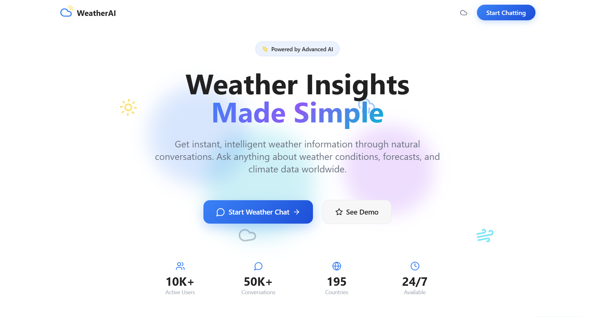

# 🌤️ Weather Chatbot with Gemini AI

<div align="center">
  
</div>

<div align="center">
  <h3>🤖 AI-Powered Weather Assistant with Real-time Data</h3>
  <p>Get instant weather updates and forecasts through intelligent conversations</p>
</div>

## 🛠️ Technologies Used

<div align="center">
  
  
  
  
  
  
</div>

## ✨ Features

- 🌍 **Real-time Weather Data** - Get current weather conditions for any location worldwide
- 🤖 **AI-Powered Responses** - Intelligent conversations powered by Google Gemini AI
- 💬 **Chat Interface** - Intuitive chat-based interaction with message history
- 🌙 **Dark/Light Mode** - Toggle between themes for comfortable viewing
- 📱 **Responsive Design** - Works seamlessly on desktop, tablet, and mobile devices
- 💾 **Session Management** - Save and manage multiple chat sessions
- 📄 **PDF Export** - Export chat conversations to PDF format
- 👍 **Message Reactions** - Like/dislike responses and copy messages
- 🔍 **Smart Location Detection** - Automatically detects locations from user queries

## 🚀 Quick Start

### Prerequisites

- Node.js (v18 or higher)
- npm or yarn package manager
- Google Gemini API key

### 📥 Installation

1. **Clone the repository**
   ```bash
   git clone https://github.com/panduthegang/Weather-App.git
   cd Weather-App
   ```

2. **Install dependencies**
   ```bash
   npm install
   # or
   yarn install
   ```

3. **Environment Setup**
   
   Create a `.env` file in the root directory:
   ```env
   VITE_GEMINI_API_KEY=your_gemini_api_key_here
   ```

4. **Start the development server**
   ```bash
   npm run dev
   # or
   yarn dev
   ```

5. **Open your browser**
   
   Navigate to `http://localhost:5173` to see the application running.

## 🔑 Getting Your Gemini API Key

1. Visit the [Google AI Studio](https://makersuite.google.com/app/apikey)
2. Sign in with your Google account
3. Click "Create API Key"
4. Copy the generated API key
5. Add it to your `.env` file as `VITE_GEMINI_API_KEY`

## 🔄 Using OpenAI Instead of Gemini

If you prefer to use OpenAI's GPT models instead of Google Gemini, follow these steps:

### 1. Get OpenAI API Key
- Visit [OpenAI Platform](https://platform.openai.com/api-keys)
- Create an account or sign in
- Generate a new API key
- Add it to your `.env` file:
  ```env
  VITE_OPENAI_API_KEY=your_openai_api_key_here
  ```

### 2. Update the Code

Replace the `generateAIResponse` function in `src/App.tsx`:

```typescript
const generateAIResponse = async (userMessage: string, weatherData?: string): Promise<string> => {
  const OPENAI_API_KEY = import.meta.env.VITE_OPENAI_API_KEY;
  
  if (!OPENAI_API_KEY) {
    throw new Error('OpenAI API key not found. Please add VITE_OPENAI_API_KEY to your .env file.');
  }

  const url = 'https://api.openai.com/v1/chat/completions';
  
  let prompt = `You are a helpful weather assistant chatbot. The user asked: "${userMessage}"\n\n`;
  
  if (weatherData) {
    prompt += `Weather data from API: ${weatherData}\n\n`;
    prompt += `Please analyze this weather data and provide a concise, helpful response about the weather.`;
  } else {
    prompt += `Please provide a helpful response. If this is a weather query, ask the user to specify a location.`;
  }

  const payload = {
    model: "gpt-3.5-turbo",
    messages: [
      {
        role: "system",
        content: "You are a helpful weather assistant that provides accurate and friendly weather information."
      },
      {
        role: "user",
        content: prompt
      }
    ],
    max_tokens: 1024,
    temperature: 0.7
  };

  try {
    const response = await fetch(url, {
      method: 'POST',
      headers: {
        'Content-Type': 'application/json',
        'Authorization': `Bearer ${OPENAI_API_KEY}`
      },
      body: JSON.stringify(payload)
    });

    if (!response.ok) {
      throw new Error(`OpenAI API error: ${response.status}`);
    }

    const data = await response.json();
    return data.choices?.[0]?.message?.content || 'Sorry, I couldn\'t generate a response.';
  } catch (error) {
    console.error('OpenAI API error:', error);
    throw new Error('Failed to generate AI response');
  }
};
```

## 📦 Build for Production

```bash
npm run build
# or
yarn build
```

The built files will be in the `dist` directory, ready for deployment.

## 🌐 Deployment

You can deploy this application to various platforms:

- **Vercel**: Connect your GitHub repo and deploy automatically
- **Netlify**: Drag and drop the `dist` folder or connect via Git
- **GitHub Pages**: Use GitHub Actions for automated deployment
- **Railway**: Deploy with a single command

## 📁 Project Structure

```
weather-chatbot/
├── public/
│   └── vite.svg
├── src/
│   ├── App.tsx          # Main application component
│   ├── main.tsx         # Application entry point
│   ├── index.css        # Global styles and theme variables
│   └── vite-env.d.ts    # Vite type definitions
├── .env                 # Environment variables (create this)
├── package.json         # Dependencies and scripts
├── tailwind.config.js   # Tailwind CSS configuration
├── tsconfig.json        # TypeScript configuration
└── vite.config.ts       # Vite configuration
```

## 🎨 Customization

### Themes
The app supports both light and dark themes. You can customize the color scheme by modifying the CSS variables in `src/index.css`.

### Weather API
Currently uses a custom weather API endpoint. You can integrate with other weather services like:
- OpenWeatherMap
- WeatherAPI
- AccuWeather

### AI Models
Switch between different AI providers by modifying the `generateAIResponse` function.

## 🤝 Contributing

1. Fork the repository
2. Create a feature branch (`git checkout -b feature/amazing-feature`)
3. Commit your changes (`git commit -m 'Add some amazing feature'`)
4. Push to the branch (`git push origin feature/amazing-feature`)
5. Open a Pull Request

## 📝 License

This project is licensed under the MIT License - see the [LICENSE](LICENSE) file for details.

## 🐛 Issues & Support

If you encounter any issues or have questions:

1. Check the [Issues](https://github.com/your-username/weather-chatbot/issues) page
2. Create a new issue with detailed information
3. Include steps to reproduce the problem

## 🙏 Acknowledgments

- Weather data provided by custom weather API
- Icons by [Lucide React](https://lucide.dev/)
- UI components styled with [Tailwind CSS](https://tailwindcss.com/)
- AI responses powered by [Google Gemini](https://ai.google.dev/)

---

<div align="center">
  <p>Made with ❤️ by <strong>Harsh Rathod</strong></p>
  <p>
    <a href="https://github.com/panduthegang">GitHub</a> •
    <a href="https://www.linkedin.com/in/harsh-rathod-2591b0292/">LinkedIn</a> •
  </p>
  <p><em>If you found this project helpful, please consider giving it a ⭐!</em></p>
</div>